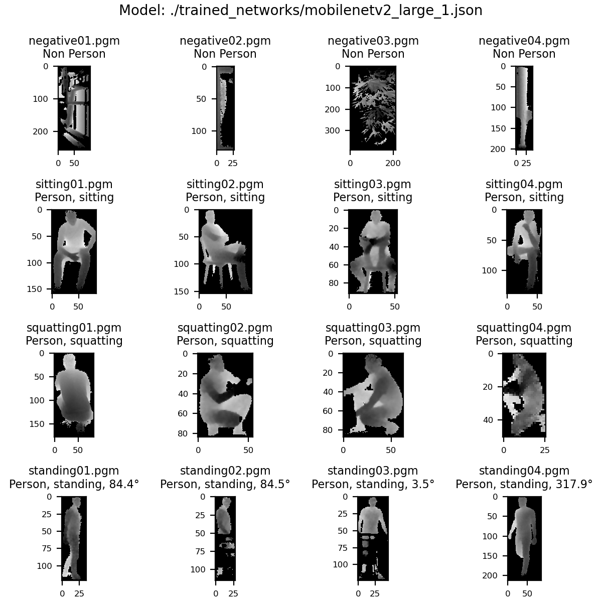

# Multi-Task Deep Learning for Depth-based Person Perception


This repository contains the code to our paper *Multi-Task Deep Learning for 
Depth-based Person Perception in Mobile Robotics* that was published on 
IROS 2020.
In our paper, we developed an efficient multi-task system based on depth images 
for person detection, body posture classification, and upper body orientation 
estimation.
Due to the use of a single lightweight neural network and an efficient 3D-based 
preprocessing, it runs in real time on mobile robots, using either a GPU 
(in our paper, we used a NVIDIA Jetson AGX Xavier) or even a CPU only. 

In particular, the repository contains the code for training, validating, and 
testing the neural networks that we selected for application on our robots. 
Furthermore, we also offer weights of already trained networks as well as a 
simple inference script, which demonstrates the application of the network on 
depth patches. 
We have already included some example patches in the samples directory that can 
be used with the script as a first demonstration. 

## Installation

1. Clone repository:
```bash
git clone https://github.com/TUI-NICR/multi-task-person-perception.git
```

2. Set up environment and install dependencies:
```bash
# create conda environment from YAML file
conda env create --file mt_person_perception.yml
# activate environment
conda activate mt_person_perception
```

3. For network training and evaluation: 
- Prepare [NICR RGB-D Orientation Data Set](https://www.tu-ilmenau.de/neurob/data-sets-code/rgb-d-orientation/):
    - Request access to the NICR RGB-D Orientation Data Set
    - Download the dataset
    - Extract files to `path/to/this/repository/datasets/NICR-RGB-D-Orientation-Data-Set`
    - Install dataset package:
    ```bash
    pip install git+git://github.com/TUI-NICR/nicr-rgb-d-orientation-data-set
    ```
    - Consider extracting patches once to speed up processing:
    ```bash
    cd /path/to/this/repository
    python extract_orientation_patches.py --dataset_basepath ./datasets/NICR-RGB-D-Orientation-Data-Set --verbose
    ```  
- Prepare [NICR Multi-Task Dataset](https://www.tu-ilmenau.de/neurob/data-sets-code/depth-multi-task/):
    - Request access to the NICR Multi-Task Dataset
    - Download the dataset
    - Extract files to `path/to/this/repository/datasets/NICR-Multi-Task-Dataset`
    - Install dataset package:
    ```bash
    pip install git+git://github.com/TUI-NICR/nicr-multi-task-dataset
    ```


## Apply already trained network for multi-task person perception
To apply a trained network to sample depth images in .pgm format, 
`sample_inference.py` can be used. 
Note that it is not necessary to install the NICR-Dataset classes from above.

We include 16 samples (see ./samples folder) and various networks 
(see ./trained_networks folder) to demonstrate application.

```bash
cd /path/to/this/repository

# Apply the provided mobilenetv2_large from the paper to some sample images
python sample_inference.py \
    --images_path ./samples \
    --model_path ./trained_networks/mobilenetv2_large_1.json
```


## Train neural network for multi-task person perception
To train a neural network on our datasets, `train.py` can be used. 
Note that it is necessary to install the NICR-Dataset classes from above.
The arguments default to training a mobilenetv2_large with the hyper-parameters 
from our paper. 
Thus, they could be omitted but are presented here for clarity.

```bash
cd /path/to/this/repository

# either specify all arguments yourself
python train.py \
    --model mobilenetv2_large_pretrained_additional_dense \
    --result_dir ./results \
    --dataset_basepath ./datasets \
    --datasets multitask+orientation \
    --optimizer adam \
    --batch_size 128 \
    --n_epochs 200 \
    --momentum 0.9 \
    --learning_rate 0.0005 \
    --learning_rate_decay 0.9 \
    --training_name training \
    --kappa 1.0 \
    --weight_mode const \
    --weight_orientation 0.72 \
    --weight_pose 0.18 \
    --weight_detection 0.1 \
    --dataset_combination concat \
    --augmentation flip \
    --tasks orientation+pose+detection

# or use the default arguments 
python train.py \
    --dataset_basepath ./datasets \ 
    --result_dir ./results

# for further information, use:
python train.py --help
```

## Evaluate trained networks
After training, the best performing network must be selected based on 
validation measures.
To do so, `test.py` can be used. 
Note that it is necessary to install the NICR-Dataset classes from above.

If a training folder is provided as `evaluation_path`, the script will 
automatically choose the best performing network according to the provided 
strategy for `choose_best_epoch_by` (orientation, detection, pose, or 
ranked_sum), creates a .json file for further use and evaluates the selected 
network on the provided test sets.

If a .json file is provided as `evaluation_path`, the script will use the 
information given in the file to do the evaluation on the test subsets. 
This allows easily reproducing the results of our paper, as shown below.

```bash
cd /path/to/this/repository

# to evaluate a trained network
python test.py \
    --evaluation_path ./results/training_<enterTimestampFromTrainingHere> \ 
    --choose_best_epoch_by ranked_sum \
    --dataset_basepath ./datasets 

# to evaluate one specific network (e.g. mobilenetv2_large from the paper)
python test.py \
    --evaluation_path ./trained_networks/mobilenetv2_large_1.json \
    --choose_best_epoch_by ranked_sum \
    --dataset_basepath datasets

# for further information, use:
python test.py --help    
```

The resulting output for the latter command should look like:
```
Detection Test Results for 'multitask':
	f1:	0.9966095425964739 (max: (0.9966720078885738, 0.05529104173183441, 57536))
	bacc:	0.9980205374798953
Detection Test Results for 'orientation':
	f1:	0.999904510296973 (max: (1.0, 0.0, 0))
	bacc:	0.0
Detection Test Results for 'multitask+orientation':
	f1:	0.9987825101282563 (max: (0.9988144075710044, 0.03105218894779682, 57517))
	bacc:	0.9989135769125592
Orientation Test Results for 'multitask':
	MAE:	nan
Orientation Test Results for 'orientation':
	MAE:	4.683100809803259
Pose Test Results for 'multitask':
	bacc:	0.9578597616776839
Pose Test Results for 'orientation':
	bacc:	0.9994907702100573
Pose Test Results for 'multitask+orientation':
	bacc:	0.9623507334989109
```
Note that it is normal that the bacc is 0.0 for the detection task on the orientation dataset because the orientation dataset does not include samples for the non-person class. 
Similarly, since the multitask dataset was not labeled with orientation information, the MAE on this multitask dataset is nan. 


## Time inference
The inference was timed on a NVIDIA Jetson AGX Xavier with 
[Jetpack 4.3](https://developer.nvidia.com/jetpack-43-archive) (TensorRT 6.0.1, 
cuDNN 7.6.3, PyTorch 1.4.0)
and a [Gigabyte AERO 14](https://www.gigabyte.com/de/Laptop/AERO-14--i7-7700HQ#kf) 
(PyTorch 1.2.0).
The results are listed in `time_inference_runtimes.csv`.
 
Reproducing the timings on a NVIDIA Jetson AGX Xavier with Jetpack 4.3 
requires:
- [the PyTorch 1.4.0 wheel](https://nvidia.box.com/shared/static/ncgzus5o23uck9i5oth2n8n06k340l6k.whl) from [NVIDIA Forum](https://forums.developer.nvidia.com/t/pytorch-for-jetson-version-1-7-0-now-available/72048)
- [the NVIDIA TensorRT Open Source Software](https://github.com/NVIDIA/TensorRT/releases/tag/v6.0.1) (`onnx2trt` is used to convert the onnx model to a TensorRT engine) 

Subsequently, `time_inference.sh` can be used to determine the inference timings.
```bash
cd /path/to/this/repository

./time_inference.sh
```


## License and Citations
The source code is published under BSD 3-Clause license, see [license file](LICENSE) for details. 

If you use the source code or the network weights, please cite the following paper:
>Seichter, D., Lewandowski, B., Höchemer D., Wengefeld T., Gross, H.-M.
*Multi-Task Deep Learning for Depth-based Person Perception in Mobile Robotics*
in: IEEE/RSJ Int. Conf. on Intelligent Robots and Systems (IROS), Las Vegas, pp. 10497-10504, IEEE 2020

```bibtex
@InProceedings{Seichter-IROS-2020,
  author    = {Seichter, Daniel and Lewandowski, Benjamin and Höchemer, Dominik and Wengefeld, Tim and Gross, Horst-Michael},
  title     = {Multi-Task Deep Learning for Depth-based Person Perception in Mobile Robotics},
  booktitle = {IEEE/RSJ Int. Conf. on Intelligent Robots and Systems (IROS), Las Vegas},
  year      = {2020},
  pages     = {10497--10504},
  publisher = {IEEE}
}
```
